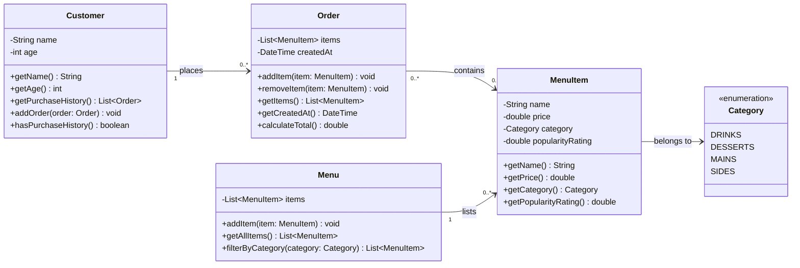

# ByteBites UML Class Diagram

The diagram below describes the core classes for customers, menu items, the menu, and orders.

```mermaid
classDiagram
  direction LR

  class Customer {
    -String name
    -int age
    +getName() String
    +getAge() int
    +getPurchaseHistory() List~Order~
    +addOrder(order: Order) void
    +hasPurchaseHistory() boolean
  }

  class Order {
    -List~MenuItem~ items
    -DateTime createdAt
    +addItem(item: MenuItem) void
    +removeItem(item: MenuItem) void
    +getItems() List~MenuItem~
    +getCreatedAt() DateTime
    +calculateTotal() double
  }

  class MenuItem {
    -String name
    -double price
    -Category category
    -double popularityRating
    +getName() String
    +getPrice() double
    +getCategory() Category
    +getPopularityRating() double
  }

  class Menu {
    -List~MenuItem~ items
    +addItem(item: MenuItem) void
    +getAllItems() List~MenuItem~
    +filterByCategory(category: Category) List~MenuItem~
  }

  class Category {
    <<enumeration>>
    DRINKS
    DESSERTS
    MAINS
    SIDES
  }

  Customer "1" --> "0..*" Order : places
  Order "0..*" --> "0..*" MenuItem : contains
  Menu "1" --> "0..*" MenuItem : lists
  MenuItem --> Category : belongs to
```
